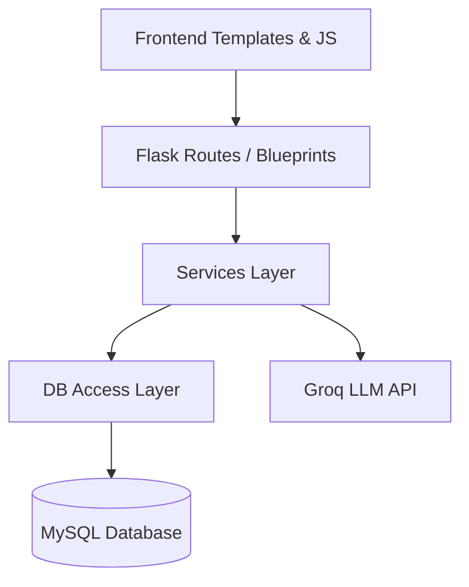

<div align="center">
  <h1>💰 CashFlow</h1>
  <p><strong>A Modern, AI-Powered Personal Finance & Cash Flow Forecasting Application</strong></p>
  
  [](https://python.org)
  [](https://flask.palletsprojects.com/)
  [](https://mysql.com/)
  [](https://docker.com)
  [](https://groq.com)
</div>

<hr>

CashFlow is a full-stack personal finance web application built with **Python, Flask, and MySQL**. It is designed with a clean, layered architecture (Clean Code principles) and helps you manage your money by tracking daily transactions, handling recurring monthly expenses, and providing intelligent cash flow forecasting. 

In addition, it features an **AI-powered Voice Assistant** that allows you to add transactions naturally using speech (Hebrew support), powered by the **Groq LLM API**.

## ✨ Key Features

- 📊 **Cash Flow Forecasting**: Automatically projects your running balance into the future by combining your current balance, ad-hoc transactions, and upcoming recurring actions.
- 🎙️ **AI Voice Input**: Record your expenses via voice! The system uses Groq LLM to extract transaction details (amount, description, date, recurring status) directly from Hebrew speech.
- 🔄 **Recurring Expenses**: Manage fixed monthly actions (e.g., salary, rent, subscriptions) by specifying the day of the month and amount.
- 📝 **Transaction Management**: Add, edit, and delete ad-hoc daily transactions seamlessly.
- 📈 **Interactive Dashboards**: Visual charts powered by **Chart.js**, highlighting your minimum projected balance and warning thresholds.
- 🌐 **Modern RTL UI**: Clean, responsive, and intuitive interface designed for Hebrew users, featuring micro-animations and a glassmorphism touch.

---

## 🏗️ Architecture & Project Structure

The project has been refactored from a monolithic app into a robust, scalable **Layered Architecture**.



### Folder Structure
- `app/` - The core application package (App Factory pattern).
  - `routes/` - Flask Blueprints (`forecast.py`, `operations.py`, `settings.py`, `voice_api.py`).
  - `services/` - Business logic (`forecast_service.py`, `kpi_service.py`, `voice_service.py`).
  - `db/` - Database access layer (`connection.py`, `transactions.py`, `recurring.py`, `settings.py`).
- `infra/` - Infrastructure code and configuration.
  - `terraform/` - AWS Infrastructure as Code (EC2, ECR, Security Groups).
  - `nginx/` - Nginx reverse proxy configuration.
  - `prometheus/` - Prometheus metrics scraping configuration.
- `static/` - Static assets (`css/`, `js/`, images).
- `templates/` - Jinja2 HTML templates.
- `tests/` - Pytest unit testing suite.

---

## 🚀 Tech Stack

**Backend:**
- Python 3.12, Flask, Gunicorn
- PyMySQL (Database Driver)
- Groq SDK (AI Integration)

**Frontend:**
- HTML5, Vanilla CSS3 (Custom Design System)
- Vanilla JavaScript (Fetch API, Web Speech API)
- Chart.js (Data Visualization)

**DevOps & Infrastructure:**
- **Database**: MySQL 8.0
- **Containerization**: Docker & Docker Compose
- **CI/CD**: GitHub Actions (Lint, Test, Build, Deploy to AWS)
- **Monitoring**: Prometheus Exporter, cAdvisor (Grafana ready)
- **Cloud**: AWS (EC2, ECR) managed via Terraform

---

## 🛠️ Getting Started (Local Development)

### Prerequisites

- [Docker](https://docs.docker.com/get-docker/) and Docker Compose
- Or, for manual execution: Python 3.12 and a local MySQL server

### Running with Docker (Recommended)

1. **Clone the repository:**
   ```bash
   git clone https://github.com/your-username/CashFlow.git
   cd CashFlow
   ```

2. **Set up Environment Variables:**
   Create a `.env` file in the root directory based on the `.env.example`:
   ```ini
   DB_USER=root
   DB_PASSWORD=your_secure_password
   DB_NAME=cashflow
   APP_IMAGE=cashflow:latest
   SECRET_KEY=your-random-secret-key
   GROQ_API_KEY=your_groq_api_key  # Get from: https://console.groq.com/keys
   ```

3. **Build and Run:**
   ```bash
   docker-compose up --build -d
   ```

4. **Access the Application:**
   Open your browser and navigate to: `http://localhost`

### Running Tests

The project uses `pytest`. To run the test suite locally:
```bash
python -m venv venv
source venv/bin/activate
pip install -r requirements.txt
python -m pytest tests/ -v
```

---

## 📝 License

This project is licensed under the MIT License - see the LICENSE file for details.
